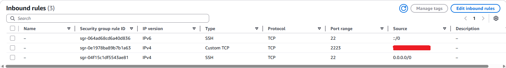
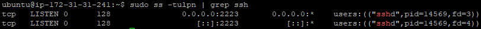
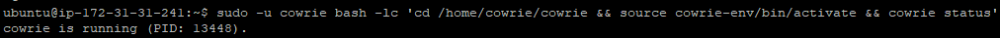
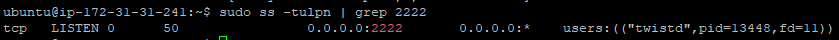
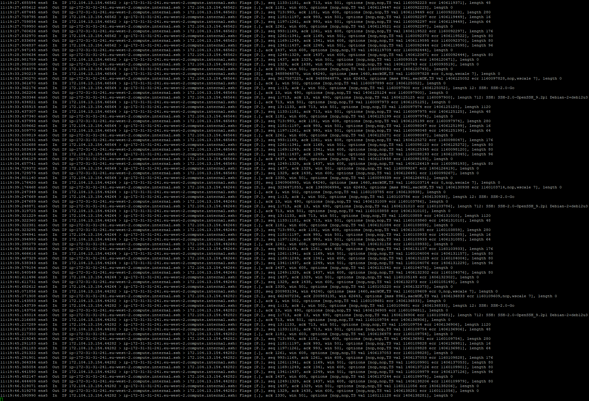
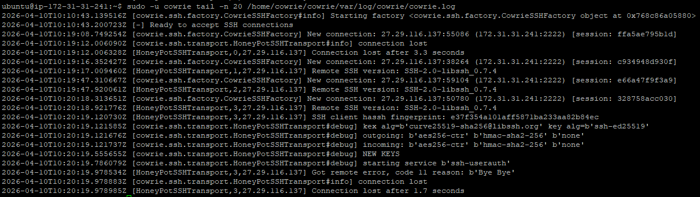
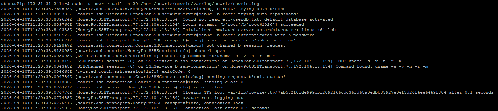
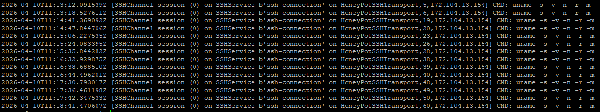

# SSH Honeypot (Cowrie on AWS)

Deployed a Cowrie SSH honeypot on AWS EC2 to capture and analyse real-world attack activity.

---

## 📖 Scenario

A company wanted to understand the level of exposure and threat activity targeting their publicly accessible infrastructure.

As part of a security assessment, I was tasked with deploying a lightweight honeypot to:

- Monitor unsolicited inbound SSH traffic  
- Capture attacker behaviour and command execution  
- Identify common reconnaissance techniques used by automated threats  

To achieve this, I deployed a Cowrie SSH honeypot on AWS EC2 and configured it to simulate a vulnerable system while safely logging all interactions.

The goal was to provide visibility into real-world attack patterns without exposing production systems to risk.

---

## 🛠️ Architecture

- AWS EC2 (Ubuntu)
- Cowrie SSH honeypot
- Port redirection (22 → 2222)
- Network traffic monitoring (tcpdump)

---

## 🚀 Deployment & Configuration

### AWS Security Group

Allowed inbound SSH traffic from the internet.

---

### Port Redirection (iptables)

Redirected incoming SSH traffic to the honeypot.

---

### Cowrie Running

Confirmed Cowrie is running correctly.

---

### Honeypot Listening

Cowrie listening for incoming SSH connections on port 2222.

---

## 🌐 Network Activity (Live Traffic)

Captured real-time SSH traffic hitting the instance.

---

## 🔐 Attack Simulation & Observations

### SSH Handshake / Connection Attempts

Observed automated scanners initiating SSH connections.

---

### Successful Login & Command Execution

Captured attacker session and commands executed inside the honeypot.

---

### Automated Attack Behaviour

Repeated command execution patterns indicate scripted attacks.

---

### No Blocking Controls in Place

Verified that no firewall or controls were blocking inbound attempts.

---

## 📊 Key Takeaways

- Public-facing SSH services are scanned almost immediately  
- Attackers use automated tools for:
  - Credential brute forcing  
  - System reconnaissance (`uname -a`, etc.)  
- Honeypots provide safe visibility into attacker behaviour  
- Real-world traffic can be captured and analysed with minimal infrastructure  

---

## 📌 Skills Demonstrated

- AWS EC2 deployment  
- Linux system administration  
- Network traffic analysis (tcpdump)  
- SSH protocol understanding  
- Threat detection and monitoring  
- Honeypot deployment (Cowrie)  

---

## ⚠️ Disclaimer

This project was conducted in a controlled environment for educational purposes only.
